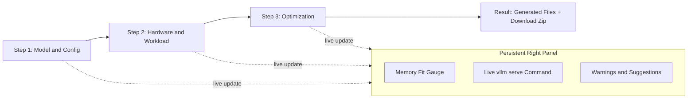

# Easy-vLLM Build Plan

A Flask "config-to-deployment" generator for vLLM. Users answer 3 short steps, see a live memory-fit gauge + generated `vllm serve` command, then download a zip with `docker-compose.yml`, `.env`, `test_client.py`, `test_curl.sh`, `README.md`, `config_summary.json`. The killer feature is the **live memory estimator** that flags Good / Risky / Likely-OOM and suggests fixes.

## Tech stack

- **Backend**: Flask 3, Pydantic v2, Jinja2, python-dotenv
- **Frontend**: server-rendered HTML + vanilla JS + CSS variables (no SPA framework). Lucide icons via inline SVG. Optional Alpine.js (~10 KB) only if a section gets too imperative; otherwise pure vanilla.
- **Templating for generated artifacts**: Jinja2 (separate template folder so site templates and artifact templates don't collide)
- **Zip**: stdlib `zipfile`, in-memory `BytesIO`
- **No DB, no auth, no Docker execution from the app** (per the doc's MVP guidance - generate files only)

## Project structure

```
easy-vllm/
  app.py
  requirements.txt
  .gitignore
  README.md            # already present
  LICENSE              # already present

  easy_vllm/
    __init__.py
    schemas.py             # Pydantic VllmDeploymentRequest + sub-models
    gpu_presets.py         # canonical GPU dropdown list
    config_parser.py       # parse uploaded HF config.json -> ModelConfigInfo
    memory_estimator.py    # weight + KV cache math, fit verdict, suggestions
    command_builder.py     # build `vllm serve ...` args list
    docker_generator.py    # render artifact templates -> dict[filename, str]
    validators.py          # cross-field warnings list
    zip_exporter.py        # bundle dict[filename, str] into BytesIO zip

  templates/
    base.html
    index.html
    _step_model.html
    _step_hardware.html
    _step_optimization.html
    _live_panel.html
    _result.html
    artifacts/
      docker-compose.yml.j2
      env.j2
      test_client.py.j2
      test_curl.sh.j2
      README.generated.md.j2
      config_summary.json.j2

  static/
    css/styles.css
    js/app.js
    img/logo.svg

  tests/
    test_memory_estimator.py
    test_command_builder.py
    test_config_parser.py
```

## Flask routes

- `GET /` -> render `index.html` with the 3-step wizard + live panel
- `POST /api/parse-config` (multipart) -> accept `config.json`, return extracted fields (`model_type`, `num_hidden_layers`, `hidden_size`, `num_attention_heads`, `num_key_value_heads`, `head_dim`, `vocab_size`, `max_position_embeddings`, `torch_dtype`, `quantization_config`, plus `is_uncertain` flag for MoE/multimodal)
- `POST /api/estimate` (json) -> validate partial config with Pydantic, return `{ weight_gb, kv_cache_gb, runtime_gb, total_gb, usable_gb, fit_status, percent_used, warnings, suggestions, vllm_command }`
- `POST /api/generate` (json) -> validate, render all artifacts, return a zip file download
- `GET /api/gpu-presets` -> JSON list

State stays client-side; the front-end debounces (300 ms) and re-posts the full form to `/api/estimate` on every change.

## UI: hybrid 3-step wizard + persistent live panel

Two-column desktop layout. Left = current step (60%), right = sticky live panel (40%). Mobile = stacked, with the live panel collapsing into a sticky bottom drawer that expands on tap.



### Step 1 — Model & Config

- HF model ID OR local path (radio toggle)
- Served model name (auto-derived; editable)
- "Private HF model" toggle -> reveals an HF_TOKEN note
- "Trust remote code" toggle (warning chip below)
- `config.json` drag-drop upload zone -> on success, shows a card with extracted fields and confidence (clear vs uncertain)
- If no upload: numeric input for "Approximate parameter count (in B)" so the estimator still works

### Step 2 — Hardware & Workload

- **GPU preset dropdown** (per the user's choice): RTX 3090 24GB, RTX 4090 24GB, A100 40GB, A100 80GB, H100 80GB, H200 141GB, L40S 48GB, RTX 6000 Ada 48GB, "Custom (enter VRAM)"
- GPU count (1-8)
- Tensor parallel size (auto = GPU count; editable when Advanced is on)
- GPU memory utilization slider (0.5-0.95, default 0.90)
- Expected input tokens, output tokens, concurrent requests (max-num-seqs)

### Step 3 — Optimization (Simple/Advanced toggle at top)

**Simple** (default):
- dtype: auto / bfloat16 / float16
- Quantization: None / AWQ / GPTQ / FP8 / BitsAndBytes / GGUF (with one-line "good for" hints)
- Enable prefix caching (default on)

**Advanced** (collapsible):
- `--kv-cache-dtype` (auto/fp16/bf16/fp8)
- `--max-num-batched-tokens`
- `--pipeline-parallel-size`
- `--cpu-offload-gb`
- `--load-format` (only forced for BnB/GGUF, otherwise auto)
- `--generation-config vllm` toggle (default on)
- API key (becomes `--api-key ${VLLM_API_KEY}`)
- Custom image tag override (default `vllm/vllm-openai:latest`)
- Extra raw vLLM flags textarea (passthrough)

### Persistent live panel

- **Memory fit gauge** — circular SVG progress, color-coded (green <80%, amber 80-100%, red >100%). Numbers animate via `requestAnimationFrame` count-up.
- **Breakdown rows**: weights, KV cache, runtime overhead, total, usable.
- **Warnings & suggestions** — color-coded chips (info/warning/danger), each suggestion is one actionable line.
- **Generated command preview** — `vllm serve ...` block, monospace, with a copy button. Updates with the form, with subtle highlight pulse on change.

### Final result view

After the user clicks "Generate deployment", the live panel morphs into a result card showing the generated file tree, per-file copy buttons, and a primary "Download zip" CTA.

## Memory estimator math (`easy_vllm/memory_estimator.py`)

```python
BYTES_PER_WEIGHT = {
    "float32": 4.0, "float16": 2.0, "bfloat16": 2.0,
    "fp8": 1.0, "int8": 1.0,
    "int4": 0.5, "awq": 0.5, "gptq": 0.5, "bitsandbytes_4bit": 0.5,
}
OVERHEAD = 1.15
RUNTIME_GB = 2.0  # CUDA graphs, kernels, fragmentation

# weights per gpu
weight_gb = (params * bytes_per_weight * OVERHEAD) / 1024**3 / tp_size

# kv cache per gpu
kv_heads_per_gpu = ceil(num_kv_heads / tp_size)
kv_bpt = 2 * num_layers * kv_heads_per_gpu * head_dim * kv_dtype_bytes
kv_cache_gb = (kv_bpt * max_model_len * max_num_seqs) / 1024**3

required = weight_gb + kv_cache_gb + RUNTIME_GB
usable = gpu_total_gb * gpu_memory_utilization
fit = "Good" if required < 0.8*usable else "Risky" if required <= usable else "Likely OOM"
```

When config.json is missing real param count, fall back to the dense-decoder approximation `12 * L * H^2 + vocab*H` and mark `is_estimate=true` (the UI shows a "rough estimate" badge). For MoE/multimodal, surface "uncertain - please enter parameter count manually".

The suggestions engine returns ordered fixes when fit is Risky/OOM: reduce `max-model-len`, reduce `max-num-seqs`, switch to AWQ/GPTQ/BnB, raise `--tensor-parallel-size`, enable `--cpu-offload-gb`.

## Validators (cross-field warnings)

Implemented in `validators.py`, run on every estimate call:

- `tensor_parallel_size > gpu_count` -> error
- `gpu_memory_utilization > 0.95` -> warning
- `trust_remote_code = true` -> caution chip
- AWQ/GPTQ chosen but uploaded `config.json` has no `quantization_config` -> warning
- BitsAndBytes chosen -> info: "needs a custom image with `bitsandbytes` installed; see generated README"
- HF id matches a known gated namespace (e.g. `meta-llama/`, `mistralai/Mistral-Large`, `google/gemma`) and no HF token flag -> warning
- `pipeline_parallel_size > 1` -> warning about Ray/NCCL complexity
- `max-num-seqs * max-model-len` exceeds reasonable budget -> nudge

## Command builder (`easy_vllm/command_builder.py`)

Builds the args list, joining with ` \` + newline for the docker-compose `command:` block and a single-line variant for the README. Emits flags in this order: `--model`, `--served-model-name`, `--host 0.0.0.0`, `--port 8000`, `--dtype`, `--max-model-len`, `--gpu-memory-utilization`, `--tensor-parallel-size`, `--pipeline-parallel-size` (only if >1), `--max-num-seqs`, `--max-num-batched-tokens` (if set), `--quantization` (if set), `--load-format` (auto-add for `bitsandbytes`), `--kv-cache-dtype` (if set), `--cpu-offload-gb` (if set), `--enable-prefix-caching` (if on), `--generation-config vllm` (if on), `--trust-remote-code` (if on), `--api-key ${VLLM_API_KEY}` (if set), plus any raw passthrough.

## Generated `docker-compose.yml` template

```yaml
services:
  vllm:
    image: {{ image }}
    container_name: easy-vllm-server
    restart: unless-stopped
    ports:
      - "${VLLM_PORT:-8000}:8000"
    ipc: host
    volumes:
      - ${HF_CACHE_DIR:-~/.cache/huggingface}:/root/.cache/huggingface
      - ${LOCAL_MODEL_DIR:-./models}:/models
    environment:
      HF_TOKEN: ${HF_TOKEN:-}
      VLLM_ENABLE_CUDA_COMPATIBILITY: ${VLLM_ENABLE_CUDA_COMPATIBILITY:-0}
    command: >
      {{ vllm_command_multiline }}
    deploy:
      resources:
        reservations:
          devices:
            - driver: nvidia
              count: ${GPU_COUNT:-1}
              capabilities: [gpu]
```

(`.env` lists every variable with the wizard's chosen defaults.)

## Theming & animations

- CSS variables on `:root` and `:root[data-theme="dark"]`: `--bg`, `--surface`, `--surface-2`, `--border`, `--text`, `--text-muted`, `--accent`, `--accent-fg`, `--success`, `--warning`, `--danger`. Theme toggle persists in `localStorage`; first load reads `prefers-color-scheme`.
- Animations: step slide+fade (220 ms), gauge fill cubic-bezier, count-up numbers, dropzone bounce on drop, button hover lift + focus ring, monospace command pulse on change, theme toggle sun/moon rotate. All gated behind `prefers-reduced-motion`.
- Layout: CSS Grid, `clamp()` font sizing, fluid spacing, mobile-first; live panel becomes a bottom drawer below 900 px.

## What's intentionally OUT of MVP

Per the user's selections and the doc's MVP guidance: built-in example presets, auto-generated custom Dockerfile (BnB users get instructions in the README instead), live Docker execution, multi-node, K8s, benchmark runner, GPU auto-detection. Architecture leaves clean seams to add these later.