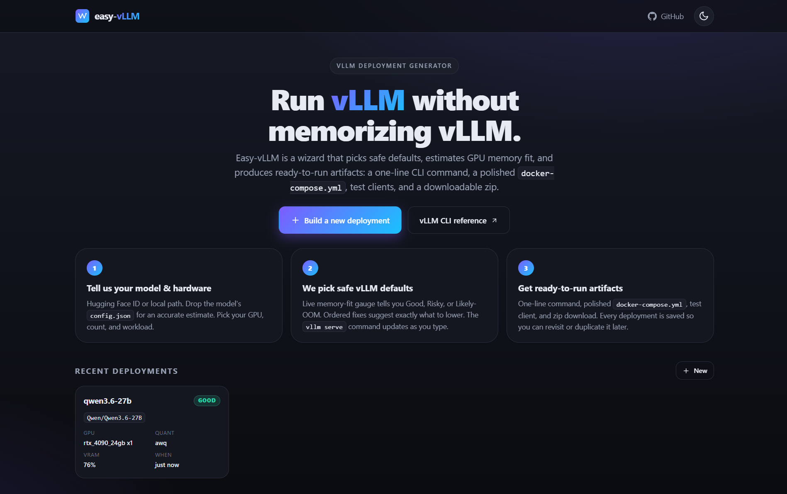
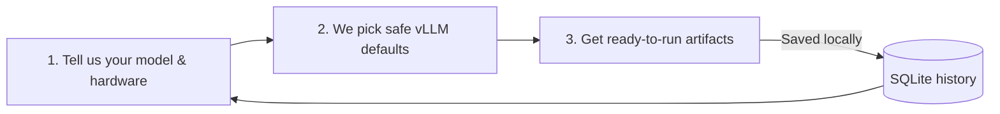
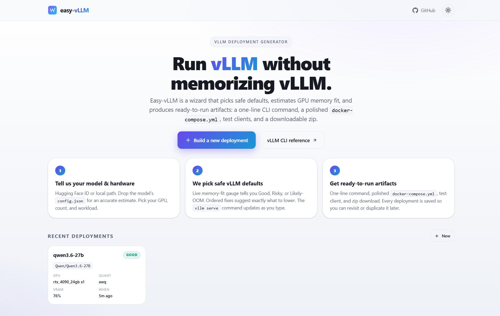
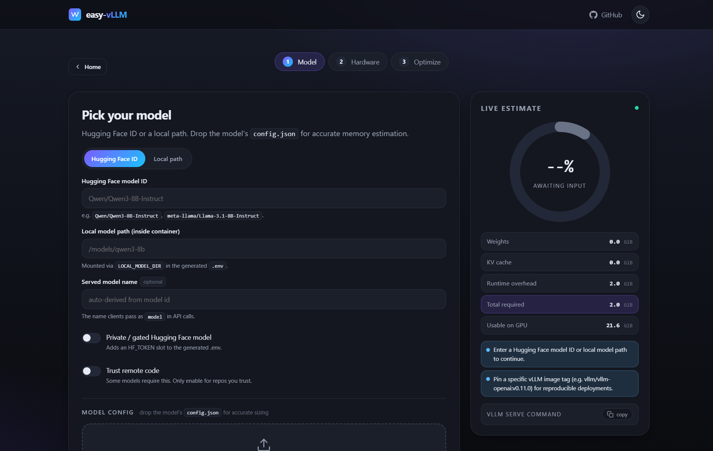
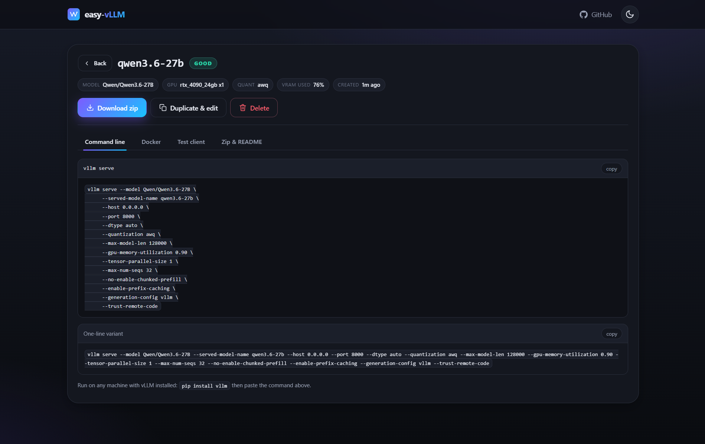
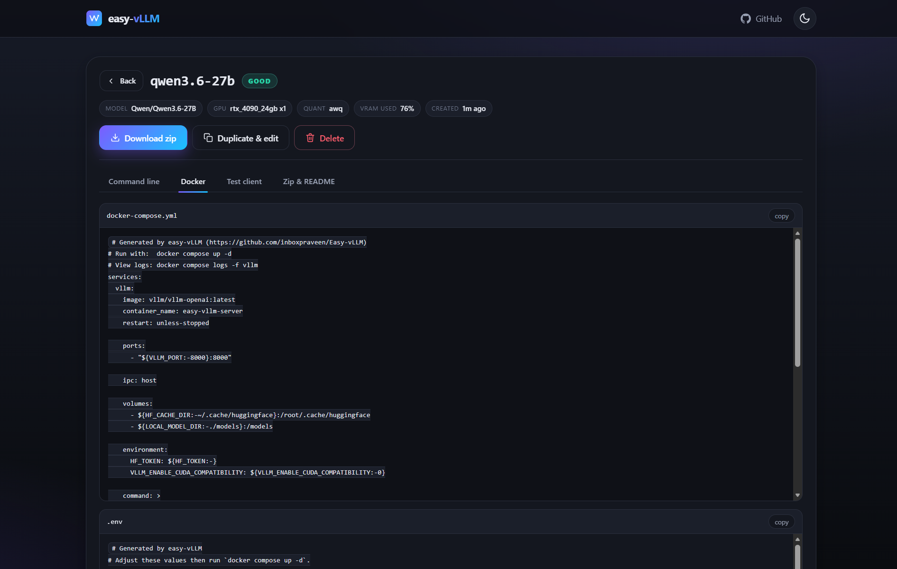
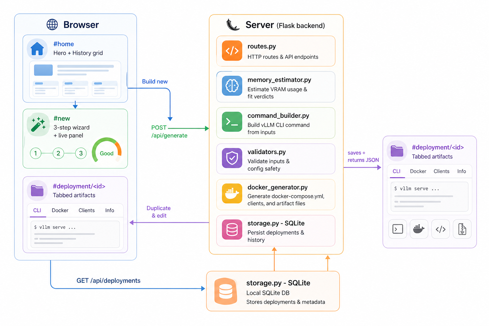

<div align="center">

# Easy-vLLM

**The fastest way to ship a [vLLM](https://github.com/vllm-project/vllm) deployment without memorizing every CLI flag.**

[](https://www.python.org/)
[](https://flask.palletsprojects.com/)
[](https://github.com/vllm-project/vllm)
[](LICENSE)

A small, beautiful Flask web app that walks you through a 3-step wizard, estimates GPU memory fit live, and outputs production-grade vLLM deployment artifacts (CLI command, `docker-compose.yml`, test clients, downloadable zip). Every deployment is saved locally so you can revisit, copy, or duplicate it later.



</div>

---

## Why Easy-vLLM?

vLLM is one of the best open-source engines for high-throughput LLM serving, but its CLI exposes 100+ flags. Most beginners (and many experienced engineers) get stuck guessing tensor-parallel size, KV-cache dtype, max-model-len, quantization, or how much VRAM their model will actually need.

**Easy-vLLM removes that guesswork.** You answer 3 short questions, see a live memory verdict (Good / Risky / Likely-OOM), and walk away with a copy-pasteable `vllm serve` command and a `docker compose up -d`-ready folder.

> Easy-vLLM is a community helper. It does not fork or replace vLLM; it generates safer configurations for it.

## How it works in 3 steps



1. **Tell us your model & hardware** - paste a Hugging Face ID (or local path), drop the model's `config.json` for accurate sizing, pick your GPU and workload.
2. **We pick safe vLLM defaults** - a live circular gauge tells you if it fits, an ordered fix list shows exactly what to lower, and the `vllm serve` command updates as you type.
3. **Get ready-to-run artifacts** - one tabbed view with the CLI command, polished `docker-compose.yml`, test clients, and a zip download. Every generated deployment is automatically saved to a local SQLite history.

## Application UI









## Quick start

```bash
# 1. Install dependencies (Python 3.10+).
pip install -r requirements.txt

# 2. Start the Flask app.
python app.py

# 3. Open the wizard.
# http://localhost:5000
```

That is it. The first generated deployment also creates the local history database under `instance/easy_vllm.db` so you do not need to set anything up.

Optional: run the test suite.

```bash
pytest -q
```

## Feature tour

### Hero & history
- A clean landing page that explains the project in three plain-English steps.
- A "Recent deployments" grid: each card shows the model, GPU preset, quantization, VRAM verdict, and how long ago you generated it. Click any card to jump straight to the artifacts view.

### Three-step wizard
- **Step 1 - Model**: HF ID or local path, served-model-name auto-derive, drag-drop `config.json` parser (handles dense, MoE, and multimodal models with confidence flags).
- **Step 2 - Hardware**: GPU preset dropdown (RTX 3090 → H200, B200, MI300X), VRAM, count, tensor-parallel, pipeline-parallel, GPU utilization slider, expected input/output tokens, max concurrent requests.
- **Step 3 - Optimize**: 9 collapsible sections covering precision, KV cache, scheduling, LoRA, speculative decoding, tools/reasoning/chat, API server, loading & distribution, and multimodal limits.

### Live memory estimator (right-hand panel)
- Color-coded circular gauge (green / amber / red) with count-up animation.
- Per-component breakdown: weights, KV cache, runtime overhead.
- Ordered fix suggestions when fit is Risky / Likely-OOM.
- Live preview of the `vllm serve` command, with copy.

### Tabbed artifacts view
After you click **Generate deployment**, the wizard hands off to an artifacts view with four tabs:

| Tab | Contents |
|---|---|
| Command line | Multi-line and one-line `vllm serve ...` |
| Docker | `docker-compose.yml` and `.env`, ready to copy |
| Test client | `test_client.py` (OpenAI Python) and `test_curl.sh` |
| Zip & README | Generated `README.md` preview + a single zip download |

You can also **Duplicate & edit** any past deployment to reuse all its settings without retyping anything.

### vLLM options coverage

| Category | Simple | Advanced |
|---|---|---|
| Identity | model id, served name, host, port | tokenizer, revision, download dir |
| Precision | dtype, quantization | enforce-eager, prefix caching, chunked prefill |
| KV cache | - | kv-cache-dtype, cpu-offload-gb, swap-space, sliding-window, cascade-attn, seed |
| Scheduling | max-num-seqs, max-model-len | max-num-batched-tokens, scheduling-policy, async-scheduling, partial-prefills, long-prefill threshold |
| Parallelism | tensor-parallel | pipeline-parallel, data-parallel, distributed-executor-backend |
| LoRA | - | enable-lora, max-loras, max-lora-rank, lora-modules |
| Speculative | - | method (ngram, suffix, draft_model, mtp, eagle3), draft model, num-speculative-tokens |
| Tools & chat | - | enable-auto-tool-choice, tool-call-parser, reasoning-parser, chat-template |
| API & logs | api-key | allowed-origins, enable-log-requests, max-log-len |
| Multimodal | - | limit-mm-per-prompt |
| Image | image tag, generation-config | extra raw flags passthrough |

## Architecture



## Memory estimator math

Per GPU, with `tp` = tensor-parallel and `pp` = pipeline-parallel:

- `weight_gb = (params * bytes_per_weight * 1.15) / 1024^3 / (tp * pp)`
- `kv_bytes_per_token = 2 * num_layers * ceil(kv_heads / tp) * head_dim * kv_dtype_bytes`
- `kv_cache_gb = kv_bytes_per_token * (input_tokens + output_tokens) * max_num_seqs / 1024^3`
- `required = weight_gb + kv_cache_gb + 2 GiB runtime`
- `usable = gpu_total_gb * gpu_memory_utilization (+ cpu_offload_gb)`

| Total / Usable | Status |
|---|---|
| < 85 % | Good |
| 85 % - 100 % | Risky |
| > 100 % | Likely OOM |

The estimate is intentionally rough - vLLM profiles memory at startup and the real number also depends on CUDA graphs, kernels, fragmentation, and activations - but it is accurate enough to catch obvious OOM disasters before deployment.

## Project structure

```
.
├── app.py                       # Flask entrypoint + DB init
├── requirements.txt
├── easy_vllm/
│   ├── schemas.py               # Pydantic request/response models
│   ├── gpu_presets.py           # GPU dropdown list
│   ├── config_parser.py         # parse HF config.json
│   ├── memory_estimator.py      # weights + KV cache + verdict + suggestions
│   ├── command_builder.py       # vllm serve arg builder
│   ├── validators.py            # cross-field warnings
│   ├── docker_generator.py      # render artifact templates
│   ├── zip_exporter.py          # bundle artifacts to .zip
│   ├── storage.py               # SQLite-backed deployment history
│   └── routes.py                # Flask routes + JSON API
├── templates/
│   ├── base.html
│   ├── index.html               # Single page, three views
│   ├── _hero.html               # Landing + history grid
│   ├── _step_model.html
│   ├── _step_hardware.html
│   ├── _step_optimization.html  # 9 accordion sections
│   ├── _live_panel.html         # Live memory gauge & command
│   ├── _artifacts.html          # Tabbed artifacts view
│   └── artifacts/               # Jinja2 templates for generated files
├── static/
│   ├── css/styles.css
│   ├── js/app.js                # Hash router, wizard, history, tabs
│   └── img/logo.svg
└── tests/                       # pytest suite
```

## API reference

All endpoints are JSON unless noted. Live in [easy_vllm/routes.py](easy_vllm/routes.py).

| Method | Path | Purpose |
|---|---|---|
| GET | `/` | Render the single-page app |
| GET | `/api/gpu-presets` | List GPU presets |
| POST | `/api/parse-config` | Multipart upload of HF `config.json` |
| POST | `/api/estimate` | Live memory estimate + warnings + command |
| POST | `/api/generate` | Render artifacts, save to SQLite, return record |
| GET | `/api/deployments` | List saved deployments (newest first) |
| GET | `/api/deployments/<id>` | Full deployment record + artifacts |
| GET | `/api/deployments/<id>/zip` | Download zip of artifacts |
| DELETE | `/api/deployments/<id>` | Remove from history |

## FAQ

**Where is my history stored?**
In a SQLite file at `instance/easy_vllm.db`. The `instance/` folder is in `.gitignore`. You can override the path with the `EASY_VLLM_DB` environment variable.

**Does Easy-vLLM run Docker for me?**
No. By design, the app only generates files. Running them is your call - this keeps the security boundary clean.

**Can I deploy gated Hugging Face models?**
Yes. Toggle "Private / gated Hugging Face model" on Step 1; the generated `.env` will contain an `HF_TOKEN` slot.

**My model is MoE / multimodal - the estimator says "uncertain". Why?**
The dense-decoder approximation `12 * L * H^2 + V * H` undercounts MoE expert weights and vision/audio towers. Type the actual parameter count in the "Approximate parameter count" field; the estimate becomes accurate.

**Can I edit a past deployment in place?**
We chose **Duplicate & edit** instead of in-place editing - the original stays intact while you tweak a copy. Click the button on any artifacts view.

**Does Easy-vLLM support multi-node?**
Pipeline-parallel and Ray are exposed in the wizard, but the generated `docker-compose.yml` targets a single host. Multi-node Ray/NCCL setup is up to you - the wizard surfaces a warning when you ask for `pipeline-parallel-size > 1`.

## Credits

Easy-vLLM is a community helper project built on top of the amazing [vLLM](https://github.com/vllm-project/vllm) project. All credit for vLLM's engine, OpenAI-compatible server, PagedAttention, CUDA/ROCm support, quantization integrations, and core inference runtime belongs to the official vLLM project and its contributors.

- vLLM source: <https://github.com/vllm-project/vllm>
- vLLM docs: <https://docs.vllm.ai/>

Easy-vLLM is licensed under the Apache 2.0 license. See [LICENSE](LICENSE).
